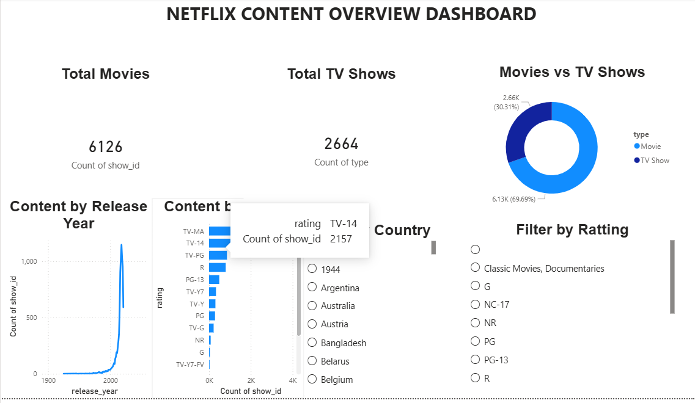
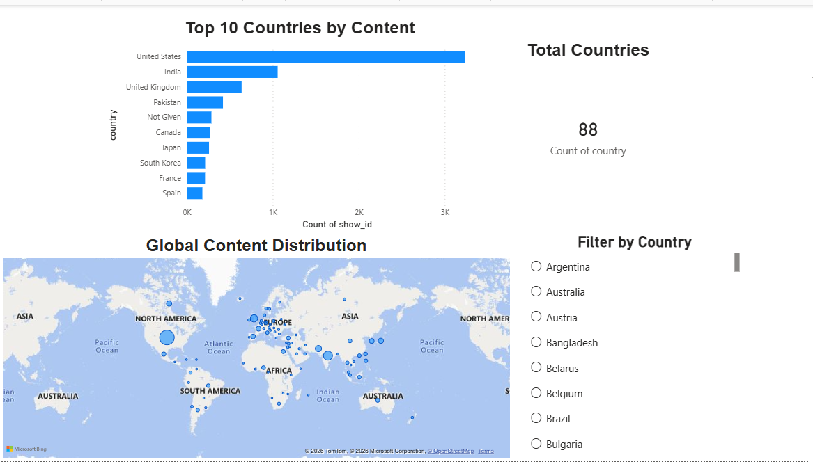
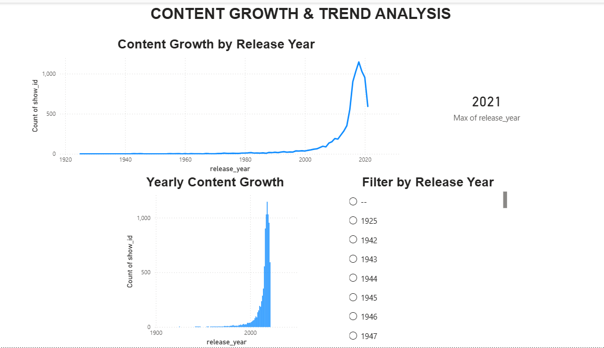

# Netflix-PowerBI-Dashboard
Power BI internship project featuring Netflix data analysis and interactive dashboards.
# Netflix Data Analysis Dashboard | Power BI

## 📌 Project Overview

This project focuses on analyzing Netflix content data using Microsoft Power BI. The goal is to explore content distribution, identify trends, and present meaningful insights through interactive dashboards.

## 🎯 Objectives

* Analyze Netflix movies and TV shows.
* Understand content distribution across countries.
* Explore content release trends over time.
* Create interactive visualizations and reports.
* Present data insights through a user-friendly dashboard.

## 🛠️ Tools & Technologies

* Microsoft Power BI
* Power Query
* DAX (if used)
* Data Visualization
* Data Analytics

## 📊 Project Tasks

The internship task list covers the following areas:

1. Data Preparation & Power BI Setup
2. Netflix Content Overview Dashboard
3. Global Content Insights Dashboard
4. Content Growth & Trend Analysis
5. Audience & Content Category Intelligence Dashboard
6. Executive Business Intelligence Dashboard

*Only the tasks actually completed are included in the final project submission.*

## ✨ Key Features

* Interactive dashboards
* KPI cards and charts
* Netflix content analysis
* Data filtering and exploration
* Visual representation of analytical findings

## 📁 Project Files

* `Kaveri_Jadhav_Auspify_PowerBI.pbix` — Power BI project file.
* `Screenshots/` — Screenshots of completed dashboards.

## ▶️ How to View the Project

1. Download the `.pbix` file from this repository.
2. Open it using Microsoft Power BI Desktop.
3. Explore the available report pages and interactive visuals.
4. 
## 📸 Dashboard Previews

### 1. Netflix Overview

### 2. Global Content Insights

### 3. Content Growth & Trend Analysis

## 🎓 Internship

**Organization:** Auspify Technologies
**Role:** Power BI Intern
**Project:** Netflix Data Analysis Dashboard

## 👩‍💻 Author

**Kaveri Jadhav**

B.Tech — Computer Science and Technology (Data Science)

---

This project was developed as part of my Power BI learning and internship journey to strengthen my data analysis, visualization, and business intelligence skills.
